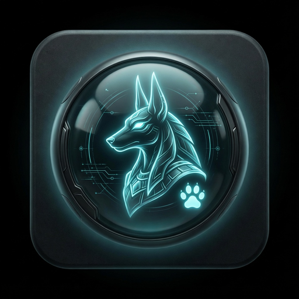
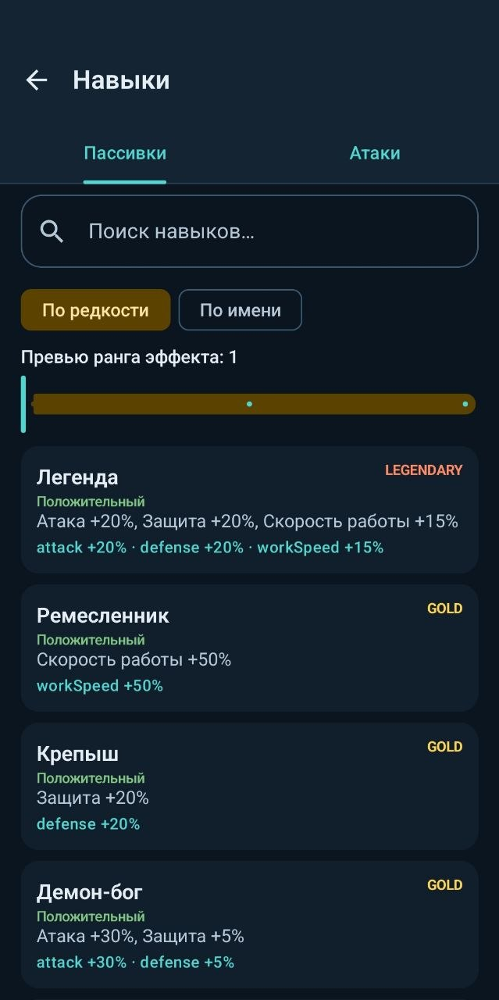
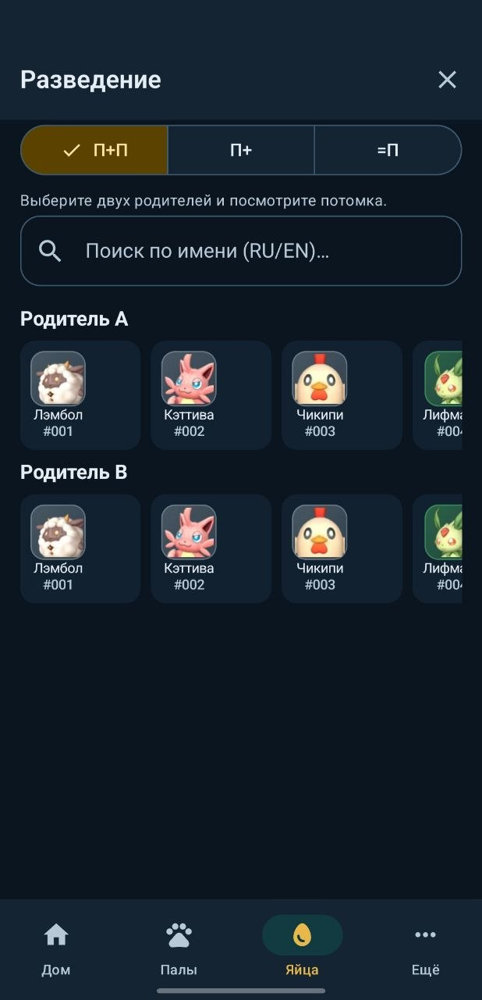
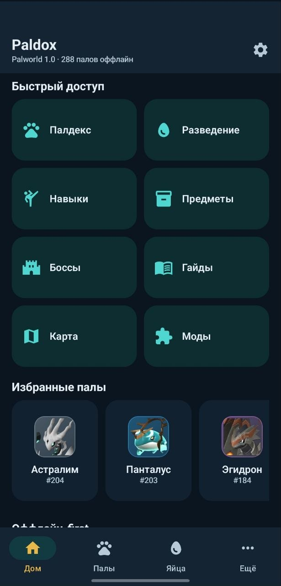
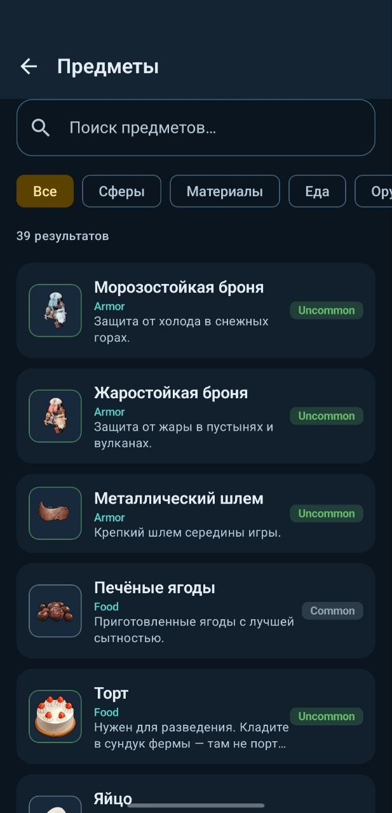
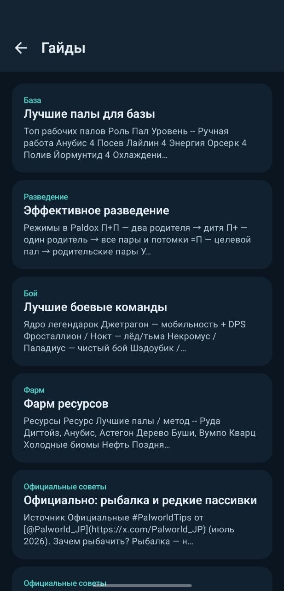

# Paldox

[](https://github.com/daaag0n00969/Paldox/releases)
[](https://github.com/daaag0n00969/Paldox/releases/latest)
[](./LICENSE)
[](https://t.me/paldox_official)
[](https://github.com/daaag0n00969/Paldox/releases/latest)
[](https://developer.android.com/jetpack/compose)

[**English**](./README_EN.md) · Русский

<p align="center">
  
</p>

**Оффлайн-компаньон для Palworld 1.0** — палдекс, разведение, навыки, предметы, боссы, гайды и интерактивная карта.  
Без аккаунтов. Без аналитики. **Без рекламы.** Открытый исходный код.

> Независимый фанатский проект · **dag0n00969** · собран с **GrokBuild (Grok 4.5)**  
> Не связан с издателем игры. Palworld — торговая марка правообладателей.

---

## ⬇️ Скачать APK

Свежий установщик всегда в **[Releases](https://github.com/daaag0n00969/Paldox/releases/latest)** — файл прикреплён к релизу (Assets).

<p align="center">
  <a href="https://github.com/daaag0n00969/Paldox/releases/latest">
    
  </a>
</p>

| Файл | Назначение |
|------|------------|
| **`Paldox-x.y.z.apk`** | Release (рекомендуется для RuStore / 4PDA / установки) |
| **`Paldox-x.y.z-debug.apk`** | Debug (`com.paldox.app.debug`) — для тестов |

**Как установить**
1. Откройте [Latest Release](https://github.com/daaag0n00969/Paldox/releases/latest)
2. В блоке **Assets** скачайте `Paldox-….apk`
3. На Android разрешите установку из неизвестных источников (если нужно)
4. Package: `com.paldox.app` · Android **8.0+**

Также: **RuStore**, **4PDA**, этот репозиторий.

---

## ✨ Возможности

| | |
|--|--|
| 📘 **Палдекс** | 288 палов, номера Palpedia 1.0, иконки оффлайн, поиск RU/EN |
| 🥚 **Разведение** | P+P · P+ · =P, ранги 1.0, special combos |
| ⚔️ **Навыки** | Активные и пассивные |
| 🎒 **Предметы** | Крафт, дроп, магазины, иконки |
| 🗼 **Боссы** | Башни, тактика, контр-палы |
| 📖 **Гайды** | Читаемые гайды + личные заметки |
| 🗺️ **Карта** | Интерактивная [Pindrop](https://pindrop.gg/palworld/map) (нужен интернет) |
| 🌙 **Настройки** | Тема, язык, обратная связь, «Реклама нет», legal |
| 🚫 **Без рекламы** | Кроме упоминаний Pocketpair и xAI — никого не продвигаем |

---

## 📸 Скриншоты

<p align="center">
  
  
  
</p>
<p align="center">
  
  
  
</p>

---

## 🛠️ Стек

- **Kotlin** · **Jetpack Compose** · **Material 3**
- **Room** + `seed_data.json` (оффлайн после установки)
- **Hilt** · **Coil** · **DataStore**
- Target **API 35** · min **API 26**

```
app/src/main/java/com/paldexpro/
├── data/      # Room, seed, prefs
├── domain/    # breeding, stats
├── di/
└── ui/        # Compose screens
```

---

## 🔧 Сборка

**Нужно:** JDK 17, Android SDK 35.

```bash
# Debug
./gradlew assembleDebug
# → app/build/outputs/apk/debug/Paldox-<version>-debug.apk

# Release (нужен keystore.properties)
./gradlew assembleRelease
# → app/build/outputs/apk/release/Paldox-<version>.apk
```

Подпись: скопируйте `keystore.properties.example` → `keystore.properties`.

Тесты:

```bash
./gradlew testDebugUnitTest
```

---

## 📜 Changelog

Полная история: **[CHANGELOG.md](./CHANGELOG.md)**

### Последнее
- **1.5.1** — экран «Реклама», hero-арт  
- **1.5.0** — карта Pindrop, обратная связь, фикс About  
- **1.4.x** — иконка, RU-имена, бридинг 1.0, RuStore/4PDA  

---

## ⚖️ Legal

| | |
|--|--|
| Privacy | [EN](./docs/legal/PRIVACY_POLICY.md) · [RU](./docs/legal/PRIVACY_POLICY_RU.md) |
| Terms | [EN](./docs/legal/TERMS_OF_SERVICE.md) · [RU](./docs/legal/TERMS_OF_SERVICE_RU.md) |
| EULA | [EN](./docs/legal/EULA.md) · [RU](./docs/legal/EULA_RU.md) |
| Disclaimer | [CONTENT_DISCLAIMER](./docs/legal/CONTENT_DISCLAIMER.md) |
| Публикация | [RuStore](./docs/store/RUSTORE_LISTING.md) · [4PDA](./docs/store/FOURPDA_LISTING.md) · [Checklist](./docs/store/PUBLISHING_CHECKLIST.md) |
| Security | [SECURITY_AUDIT](./docs/SECURITY_AUDIT.md) |

---

## 💬 Связь

- Telegram: [t.me/paldox_official](https://t.me/paldox_official)  
- Email: [dag0n00969@gmail.com](mailto:dag0n00969@gmail.com)  
- X: [@nikolas_borman](https://x.com/nikolas_borman)  
- Issues: [GitHub Issues](https://github.com/daaag0n00969/Paldox/issues)

---

## ⭐ Star

Самый простой способ поддержать проект — нажать **⭐ Star** вверху страницы.

---

## 📄 License

Исходный код: **MIT** — см. [LICENSE](./LICENSE).  
Игровые ассеты и IP Palworld принадлежат правообладателям; используются только в фанатских справочных целях.
